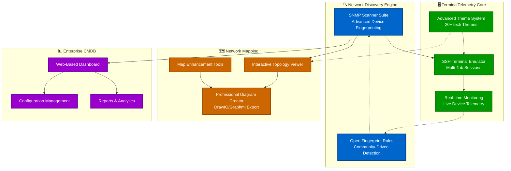

# TerminalTelemetry Enterprise


**TerminalTelemetry Enterprise** is a comprehensive network management ecosystem that combines SSH terminal capabilities, real-time device monitoring, network discovery, topology visualization, and enterprise-grade asset management in a unified, tech-inspired platform.

## Platform Overview



## 🚀 Quick Start

### Installation
```bash
pip install TerminalTelemetry
termtel-con  # First run - bootstrap themes
termtel      # Launch main application
```

### First-Time Setup
1. **Launch** the application - themes auto-bootstrap on first run
2. **Create connections** via File → Sessions or Quick Connect
3. **Open monitoring** via Tools → Telemetry Dashboard
4. **Customize appearance** via View → Themes (20+ options)
5. **Explore tools** via the comprehensive Tools menu

## 🏗️ Platform Components

### 🔍 **Network Discovery Engine**
*Advanced SNMP-based network discovery with open fingerprinting*

**Key Features:**
- **TCP pre-filtering** for 3-5x faster scanning
- **SNMPv3/v2c fallback** with community auto-detection
- **Open fingerprint rules** - completely transparent device detection
- **Domain intelligence** - automatic hostname normalization
- **Real-world error handling** - built for unreliable networks
- **Enhanced GUI Import Tool** - Visual import with vendor normalization and detailed error reporting

**Detailed Documentation:** [📖 Network Scanner Suite Guide](README_Scanner.md)

---

### 🖥️ **TerminalTelemetry Core Platform**
*SSH terminal emulator with integrated real-time monitoring*

**Key Features:**
- **Multi-tab SSH terminals** with xterm.js backend
- **Real-time telemetry** for network device monitoring
- **200+ TextFSM templates** for multi-vendor parsing
- **Advanced theme system** with 20+ tech-inspired themes
- **Encrypted credential storage** with enterprise security

**Platform Guides:**
- [📖 Complete Platform Overview](README_Overview.md)
- [📖 Real-Time Telemetry Monitoring](README_Telemetry.md)
- [📖 Advanced Theme Management](README_Theme_mgmt.md)
- [📖 Custom Widget Development](README_widgets.md)

---

### 🗺️ **Network Mapping Suite**
*Professional network topology visualization and documentation*

**Key Features:**
- **Interactive topology viewer** with zoom/pan/search
- **Professional diagram export** (DrawIO, GraphML, Visio)
- **Multi-network merging** for campus-wide maps
- **Vendor-specific icons** and automated layouts
- **Publication-ready documentation** generation

**Detailed Documentation:** [📖 Network Mapping Suite Guide](README_Maps.md)

---

### 📊 **RapidCMDB Enterprise Platform**
*Web-based configuration management and asset tracking*

**Key Features:**
- **Enterprise-scale device management** (20,000+ devices tested)
- **Configuration change tracking** with diff visualization
- **Web-based dashboard** with real-time updates
- **NetBox/LogicMonitor integration** for unified workflows
- **Advanced analytics and reporting**

**Platform Documentation:** [📖 RapidCMDB Enterprise Guide](README_RapidCMDB.md)

---

## 🔧 Platform Integration

### **Unified Workflow**
```
Network Discovery → Device Monitoring → Topology Mapping → Asset Management
```

All components share:
- **Common credential store** - one secure location for all credentials
- **Universal theming** - consistent UI across all platforms
- **Shared fingerprint rules** - community-driven device detection
- **Standard data formats** - seamless integration between tools

**Integration Guide:** [📖 Platform Integration Overview](README_integration.md)

---

## 🎯 **What Makes This Different**

### **🔓 Completely Open Ecosystem**
- **No vendor lock-in** - all detection rules are visible and editable
- **Community-driven** - shared fingerprint database
- **No licensing fees** - deploy anywhere without restrictions
- **Full transparency** - see exactly what commands are executed

### **🚀 Production-Ready Architecture**
- **Enterprise security** - AES-256 encrypted credential storage
- **Real-world reliability** - handles network timeouts and edge cases
- **Performance optimized** - TCP pre-filtering and async processing
- **Cross-platform** - Windows, macOS, Linux support

### **🎨 Modern User Experience**
- **tech aesthetic** - 20+ professionally designed themes
- **Responsive interface** - threaded operations keep UI smooth
- **Contextual tools** - right-click menus and integrated workflows
- **Extensible design** - modular architecture for custom development

---

## 📚 **Comprehensive Documentation**

### **Platform Components**
- [📖 **Network Scanner Suite**](README_Scanner.md) - SNMP discovery with open fingerprinting
- [📖 **TerminalTelemetry Platform**](README_Overview.md) - SSH terminals and real-time monitoring
- [📖 **Real-Time Telemetry**](README_Telemetry.md) - Live device monitoring and visualization
- [📖 **Network Mapping Suite**](README_Maps.md) - Topology visualization and professional diagrams
- [📖 **RapidCMDB Enterprise**](README_RapidCMDB.md) - Web-based device management and analytics

### **Advanced Topics**
- [📖 **Theme Management System**](README_Theme_mgmt.md) - Advanced theming and customization
- [📖 **Custom Widget Development**](README_widgets.md) - Extending the platform with custom widgets
- [📖 **Platform Integration**](README_integration.md) - Connecting all components together
- [📖 **Pipeline Architecture**](README_Pipeline.md) - Data flow and processing pipelines

---

## 🛠️ **Development & Support**

### **System Requirements**
- **Python**: 3.9+
- **Operating System**: Windows, macOS, Linux
- **Memory**: 4GB RAM (8GB+ for large networks)
- **Network Access**: SSH (22/TCP) and SNMP (161/UDP) to target devices

### **Development Setup**
```bash
git clone https://github.com/scottpeterman/terminaltelemetry.git
cd terminaltelemetry
pip install -e .
python -m pytest tests/
```

### **Contributing**
- **Bug Reports**: Use GitHub Issues with device platform details
- **Template Contributions**: Use built-in template editor to create/fix parsing
- **Fingerprint Rules**: Submit vendor detection improvements
- **Documentation**: Help improve guides and examples

---

## 🏆 **Enterprise Deployment**

### **Proven Scale**
- **20,000+ devices** tested in single RapidCMDB deployment
- **Sub-second response** times for standard operations
- **Multi-vendor support** across Cisco, Arista, Juniper, HP, Fortinet
- **Cross-platform deployment** on Windows, Linux, macOS

### **Security & Compliance**
- **Enterprise-grade encryption** (AES-256 + PBKDF2)
- **No data exfiltration** - purely SSH client connections
- **Audit trail** - comprehensive logging of all operations
- **Zero infrastructure** - no servers or agents required

### **Cost Benefits**
- **No licensing fees** - deploy to unlimited devices
- **Instant deployment** - pip install and run anywhere
- **Reduce vendor lock-in** - works with any SSH-accessible device
- **Engineer productivity** - familiar SSH workflow with modern tools

---

## 📜 **License & Acknowledgments**

**License:** GPLv3 - Free for personal and commercial use

**Built With:**
- PyQt6 and Python ecosystem
- xterm.js for terminal functionality
- netmiko and TextFSM for network automation
- Modern tech design principles

---

## 🤝 **Community & Support**

- **📧 GitHub Issues**: Bug reports and feature requests
- **📖 Documentation**: Comprehensive guides and API reference
- **🤝 Community**: Template library and fingerprint rule sharing

---

*"The most powerful network management platform is the one that gives you complete control and transparency over your infrastructure."*

**TerminalTelemetry** - *Where network discovery, monitoring, and management converge in a unified, open, and powerful ecosystem.*