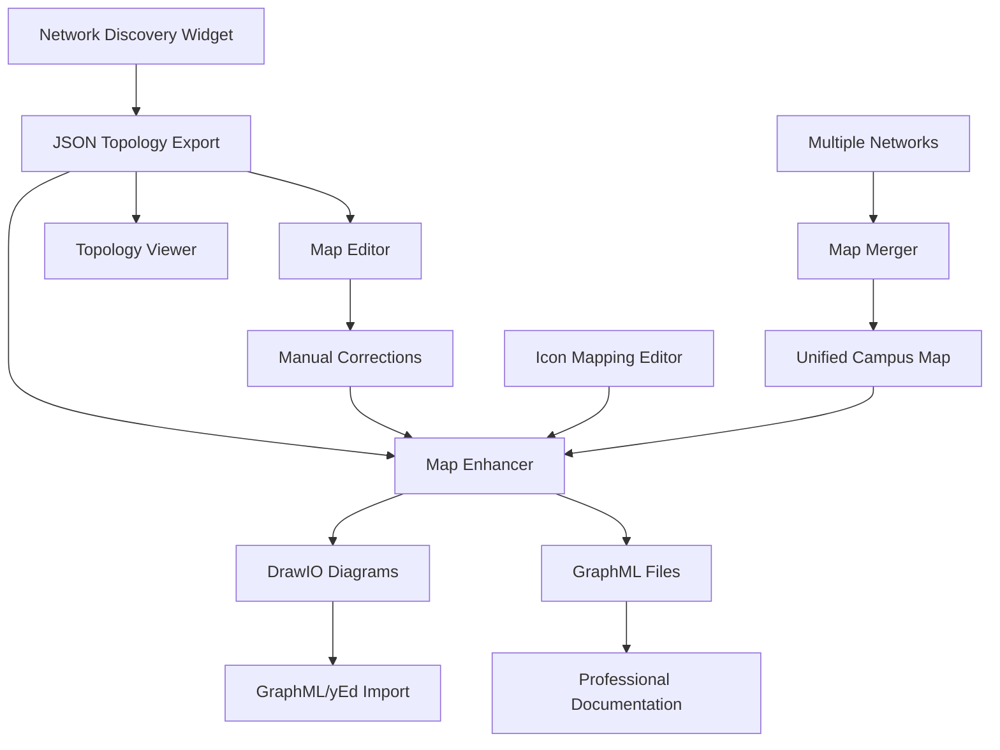

# Terminal Telemetry - Network Mapping Suite

> **Professional-grade network discovery, visualization, and topology management platform**


---

## 🗺️ Overview

The **Terminal Telemetry Network Mapping Suite** is a comprehensive collection of integrated tools that transforms raw network discovery data into professional-quality network diagrams and topology documentation. From automated discovery to publication-ready visualizations, this suite provides everything needed for enterprise network documentation.

### 🎯 **Complete Workflow Coverage**
```
Discovery → Enhancement → Editing → Visualization → Management
    ↓           ↓           ↓           ↓           ↓
   JSON    →  Icons   →  Manual   →  Interactive → Merged
  Export      Added      Cleanup     Diagrams     Maps
```

---

## 🏗️ **Suite Architecture**

### **Core Components**

| Component | Purpose | Input | Output | Use Case |
|-----------|---------|-------|--------|----------|
| **Network Discovery** | Automated device discovery | IP ranges, credentials | JSON topology | Initial network mapping |
| **Map Enhancer** | Professional diagram creation | JSON files | DrawIO, GraphML | Publication-ready diagrams |
| **Topology Viewer** | Interactive visualization | JSON topology | Web-based viewer | Real-time topology analysis |
| **Map Editor** | Manual topology refinement | JSON files | Edited JSON | Data cleanup and validation |
| **Icon Editor** | Device icon customization | Platform mappings | Icon configurations | Visual consistency |
| **Map Merger** | Multi-network consolidation | Multiple JSONs | Unified topology | Campus/WAN integration |

### **Integration Flow**


---

## 🚀 **Quick Start Guide**

### **1. Network Discovery**
```python
# Launch integrated discovery from Terminal Telemetry
# Tools → Map Tools → Network Discovery

# Configure discovery parameters:
seed_ip = "192.168.1.1"
credentials = {"username": "admin", "password": "***"}
domain = "company.local"

# Results: campus_network.json
```

### **2. Professional Diagram Creation**
```python
# Tools → Map Tools → Network Map Enhancer
input_file = "campus_network.json"
output_dir = "./network_diagrams/"

# Options:
# ✓ Include endpoint devices
# ✓ Use vendor-specific icons  
# ✓ Multiple layout algorithms
# ✓ Normalized interface names

# Results: 
# - campus_network.drawio (web-based editing)
# - campus_network.graphml (GraphML/yEd import)
```

### **3. Interactive Analysis**
```python
# Tools → Map Tools → Network Topology Viewer
# - Real-time topology exploration
# - Zoom/pan/search functionality
# - Device detail panels
# - Export capabilities
```

---

## 🛠️ **Detailed Tool Documentation**

### **🔍 Network Discovery Widget**
*Automated device discovery with intelligent topology mapping*

**Key Features:**
- **Multi-protocol discovery**: SNMP, SSH, LLDP, CDP
- **Intelligent device classification**: Automatic vendor/model detection
- **Relationship mapping**: Neighbor discovery and link correlation
- **Configurable scope**: Subnet ranges, device limits, timeouts
- **Real-time progress**: Live discovery status and device counts

**Configuration Options:**
```yaml
discovery_config:
  seed_ip: "10.0.0.1"
  domain_name: "corp.company.com" 
  username: "netadmin"
  password: "encrypted_password"
  timeout: 30
  max_devices: 1000
  layout_algorithm: "kk"  # spring, circular, tree
  exclude_patterns: ["guest", "temp", "backup"]
```

**Output Format:**
```json
{
  "device-hostname": {
    "node_details": {
      "ip": "10.0.0.1",
      "platform": "cisco_ios_xe",
      "version": "16.12.05", 
      "model": "C9300-48P"
    },
    "peers": {
      "neighbor-device": {
        "ip": "10.0.0.2",
        "platform": "cisco_ios_xe",
        "connections": [
          ["GigabitEthernet1/0/1", "GigabitEthernet1/0/24"]
        ]
      }
    }
  }
}
```

---

### **🎨 Network Map Enhancer**
*Transform raw topology data into professional network diagrams*

**Professional Diagram Features:**
- **Vendor-specific icons**: Cisco, Juniper, Arista, HP, Fortinet, Palo Alto
- **Multiple layout algorithms**: Grid, tree, balloon, hierarchical
- **Interface normalization**: Consistent port naming (Gi1/0/1, Te1/1/1)
- **Endpoint filtering**: Include/exclude end-user devices
- **Multiple export formats**: DrawIO (web editing), GraphML (desktop tools)

**Icon Library:**
```
Supported Vendors:
├── Cisco (switches, routers, firewalls, wireless)
├── Juniper (EX, MX, SRX series)
├── Arista (7xxx series switches)
├── HP/Aruba (ProCurve, CX series)
├── Fortinet (FortiGate series)
├── Palo Alto (PA series)
├── Generic (server, workstation, printer)
└── Custom (user-defined mappings)
```

**Layout Algorithms:**
- **Grid**: Structured layouts for data centers
- **Tree**: Hierarchical campus networks  
- **Balloon**: Hub-and-spoke topologies
- **Hierarchical**: Multi-tier network designs

**Export Formats:**

#### **DrawIO (.drawio)**
- Web-based diagram editing
- Collaborative editing capabilities
- Direct integration with Confluence/SharePoint
- Professional styling and themes

#### **GraphML (.graphml)**
- yEd Graph Editor compatibility
- Advanced layout algorithms
- Custom shape libraries

---

### **👁️ Interactive Topology Viewer**
*Real-time topology exploration and analysis*

**Visualization Features:**
- **Interactive navigation**: Zoom, pan, search, highlight
- **Device information panels**: Click for detailed device data
- **Layout switching**: Real-time algorithm changes
- **Node search**: Find devices by name, IP, or platform
- **Connection tracing**: Follow network paths visually

**Advanced Capabilities:**
- **SVG export**: High-quality vector graphics
- **HTML export**: Standalone web pages
- **Node filtering**: Show/hide device types
- **Path highlighting**: Trace connections between devices
- **Responsive design**: Works on desktop and mobile

**Use Cases:**
- **Incident response**: Quickly locate affected devices
- **Change planning**: Visualize impact of network changes
- **Documentation**: Interactive network maps for stakeholders
- **Training**: Educational topology exploration

---

### **✏️ Network Map Editor**
*Manual topology data refinement and validation*

**Editing Capabilities:**
- **Device management**: Add, edit, delete network devices
- **Connection editing**: Modify interface mappings
- **Bulk operations**: Mass updates via CSV import
- **Data validation**: Consistency checking and error detection
- **Platform standardization**: Normalize vendor naming

**Dual-Table Interface:**
```
┌─ TOP-LEVEL DEVICES ──────────────┐  ┌─ DISCOVERED PEERS ───────────────┐
│ Device Name │ IP Address │ Model │  │ Peer Name │ IP Address │ Platform │
├─────────────┼────────────┼───────┤  ├───────────┼────────────┼──────────┤
│ core-sw-01  │ 10.0.0.1   │ C9300 │  │ access-01 │ 10.0.1.1   │ C2960    │
│ dist-sw-01  │ 10.0.0.2   │ C9400 │  │ fw-01     │ 10.0.0.10  │ ASA5516  │
└─────────────┴────────────┴───────┘  └───────────┴────────────┴──────────┘
```

**Data Quality Features:**
- **Duplicate detection**: Identify and merge duplicate entries
- **Missing data highlighting**: Visual indicators for incomplete records
- **Platform validation**: Verify vendor/model combinations
- **Connection validation**: Check interface naming consistency

---

### **🎯 Icon Mapping Editor**
*Customize device icons for consistent visual representation*

**Icon Management:**
- **Platform-based mapping**: Assign icons by device platform
- **Model-specific icons**: Fine-grained icon assignment
- **Custom icon upload**: Add organization-specific device icons
- **Icon preview**: Real-time preview of icon assignments
- **Export/import**: Share icon configurations across teams

**Default Mappings:**
```yaml
icon_mappings:
  cisco_ios_xe:
    switch: "cisco_catalyst_switch.svg"
    router: "cisco_isr_router.svg"
  juniper_junos:
    switch: "juniper_ex_switch.svg"
    router: "juniper_mx_router.svg"
  palo_alto_panos:
    firewall: "paloalto_firewall.svg"
```

**Professional Icon Library:**
- **High-resolution SVG**: Scalable vector graphics
- **Vendor authentic**: Official vendor styling
- **Consistent styling**: Uniform color schemes and sizing
- **Device-specific**: Switches, routers, firewalls, servers, endpoints

---

### **🔄 Map Merger Tool**
*Consolidate multiple network discoveries into unified topology*

**Merging Capabilities:**
- **Multi-file selection**: Combine unlimited topology files
- **Intelligent conflict resolution**: Handle overlapping devices
- **Visual preview**: SVG preview of merged topology
- **Export multiple formats**: JSON, DrawIO, GraphML output
- **Merge validation**: Verify topology consistency

**Advanced Merging:**
```python
# Example: Merging campus networks
networks = [
    "building_a_network.json",    # Main campus building
    "building_b_network.json",    # Remote building  
    "wan_connections.json",       # WAN links
    "dmz_network.json"           # DMZ infrastructure
]

merged_result = merge_topologies(networks)
# Output: unified_campus_topology.json
```

**Conflict Resolution:**
- **Device reconciliation**: Merge duplicate device entries
- **Connection deduplication**: Remove redundant link information  
- **Attribute merging**: Combine device metadata intelligently
- **Manual review**: Flag conflicts for human review

---

## 📊 **Professional Output Examples**

### **Enterprise Network Diagram**
```
Generated from: corporate_campus.json
Format: DrawIO + GraphML
Features: ✓ Vendor icons ✓ Interface labels ✓ Hierarchical layout
```


### **Data Center Topology**
```
Generated from: datacenter_discovery.json  
Format: Grid layout with rack positioning
Features: ✓ Server icons ✓ Power/cooling overlay ✓ VLAN highlighting
```


### **Campus Network Map**
```
Generated from: merged_campus_buildings.json
Format: Geographic layout with building overlay
Features: ✓ WAN links ✓ Building boundaries ✓ Capacity indicators
```


---

## 🔧 **Advanced Configuration**

### **Discovery Templates**
Customize discovery behavior for different network types:

```yaml
# Campus Network Template
campus_template:
  discovery_method: "snmp_walk"
  neighbor_protocols: ["cdp", "lldp"]
  device_classification: "vendor_specific"
  endpoint_inclusion: false
  layout_preference: "hierarchical"

# Data Center Template  
datacenter_template:
  discovery_method: "ssh_bulk"
  connection_validation: "bidirectional"
  rack_awareness: true
  endpoint_inclusion: true
  layout_preference: "grid"
```

### **Export Customization**
Fine-tune diagram output for specific use cases:

```yaml
# Executive Presentation Format
executive_format:
  detail_level: "high_level"
  icon_style: "simplified" 
  color_scheme: "professional"
  annotations: "minimal"
  layout: "clean_hierarchy"

# Technical Documentation Format
technical_format:
  detail_level: "comprehensive"
  icon_style: "detailed"
  interface_labels: "full_names"
  ip_addresses: "visible"
  platform_info: "included"
```

### **Integration APIs**

#### **Programmatic Access**
```python
from termtel.map_tools import NetworkTopologyAPI

# Initialize API
topo_api = NetworkTopologyAPI()

# Discover network
discovery_result = topo_api.discover_network(
    seed_ip="10.0.0.1",
    credentials=creds,
    scope="campus"
)

# Generate diagrams
diagrams = topo_api.create_diagrams(
    topology_data=discovery_result,
    formats=["drawio", "graphml"],
    layout="hierarchical",
    include_icons=True
)

# Export results
topo_api.export_diagrams(diagrams, output_dir="/network_docs/")
```

#### **Batch Processing**
```python
# Process multiple network segments
networks = [
    {"name": "campus_core", "seed": "10.0.0.1"},
    {"name": "branch_office", "seed": "192.168.1.1"},
    {"name": "data_center", "seed": "172.16.0.1"}
]

for network in networks:
    result = batch_discover_and_diagram(
        network_config=network,
        output_format="professional",
        auto_merge=True
    )
```
