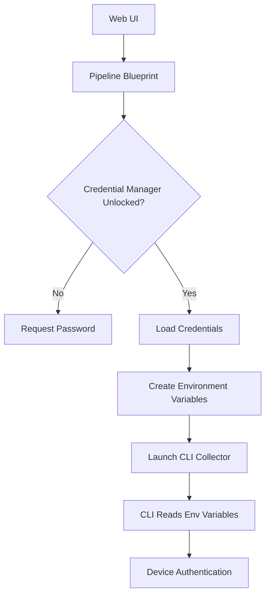

# RapidCMDB Pipeline Arc
hitecture & Secure Credentials

## Overviewh

RapidCMDB features a comprehensive network discovery and data collection pipeline with an integrated secure credential management system. The pipeline handles the complete workflow from network scanning to device configuration collection, with enterprise-grade credential security.

## Architecture Components

### 1. Pipeline Management Blueprint (`pipeline.py`)

The core orchestration layer that manages:
- Network discovery scanning
- JSON-based device collection
- Database-driven device collection
- Secure credential management integration
- Real-time progress monitoring via SocketIO

### 2. Network Scanner (`gosnmpcli`)

Go-based SNMP scanner that:
- Discovers network devices via SNMP
- Performs device fingerprinting
- Generates JSON device inventories
- Supports SNMP v1/v2c/v3

### 3. NAPALM Collectors

Two collection modes available:

#### JSON Collection (`npcollector1.py`)
- Uses JSON scan files as input
- Traditional file-based credential storage
- Suitable for one-time collections

#### Database Collection (`npcollector_db.py`) 
- Uses database as device source
- **Secure environment variable credentials**
- Advanced filtering capabilities
- Enterprise-ready credential management

### 4. Secure Credential Management

Built on the `termtel.helpers.credslib.SecureCredentials` system:
- **Encrypted credential storage**
- **Password-protected access**
- **Environment variable injection**
- **Multi-credential priority system**

## Secure Credential System Architecture

### Credential Storage

```
~/.config/rapidcmdb_collector/
├── network_credentials.yaml.enc    # Encrypted credential file
└── salt                           # Encryption salt
```

### Credential Flow



## Credential Environment Variables

### Variable Naming Pattern

The system uses standardized environment variable patterns:

```bash
NAPALM_USERNAME_<CREDENTIAL_NAME>
NAPALM_PASSWORD_<CREDENTIAL_NAME>
NAPALM_ENABLE_<CREDENTIAL_NAME>     # Optional
NAPALM_PRIORITY_<CREDENTIAL_NAME>
```

### Example Environment Variables

```bash
# Primary credentials (priority 1)
NAPALM_USERNAME_PRIMARY="admin"
NAPALM_PASSWORD_PRIMARY="SecurePassword123"
NAPALM_ENABLE_PRIMARY="EnableSecret456"
NAPALM_PRIORITY_PRIMARY="1"

# Backup credentials (priority 2)
NAPALM_USERNAME_BACKUP="backup_user"
NAPALM_PASSWORD_BACKUP="BackupPassword789"
NAPALM_PRIORITY_BACKUP="2"

# Service account (priority 3)
NAPALM_USERNAME_SERVICE="svc_napalm"
NAPALM_PASSWORD_SERVICE="ServicePassword000"
NAPALM_PRIORITY_SERVICE="3"
```

## Collection Workflows

### 1. Network Discovery Workflow

```
1. User configures scan parameters (IP ranges, SNMP communities)
2. Pipeline launches gosnmpcli scanner
3. Scanner discovers devices via SNMP
4. Results saved as JSON device inventory
5. JSON file available for collection
```

### 2. Database-Driven Collection Workflow

```
1. User unlocks secure credential manager via web UI
2. Pipeline loads encrypted credentials
3. User selects database filters (site, vendor, role, etc.)
4. Pipeline creates temporary config (NO embedded credentials)
5. Pipeline launches npcollector_db.py with environment variables
6. CLI tool loads credentials from environment variables
7. Devices collected based on database query + filters
8. Results saved to filesystem and optionally imported to database
```

## Security Features

### Credential Protection

- **Encryption at Rest**: All credentials encrypted using PBKDF2 + AES
- **Memory Protection**: Credentials only loaded when needed
- **Environment Isolation**: Each collection process gets isolated environment
- **No Disk Storage**: Credentials never written to temporary files
- **Password Protection**: Web UI requires password to unlock credentials

### Authentication Flow

```python
# 1. Web UI unlocks credential manager
network_cred_manager.unlock(password)

# 2. Pipeline loads encrypted credentials
credentials_list = get_network_credentials()

# 3. Convert to environment variables
env_vars = create_credential_env_vars(credentials_list)

# 4. Launch process with secure environment
process = subprocess.Popen(command, env=process_env)
```

### Credential Priority System

The system supports multiple credential sets with priority ordering:

```yaml
credentials:
  - name: primary
    username: admin
    password: encrypted_password_1
    priority: 1
  - name: backup  
    username: backup_admin
    password: encrypted_password_2
    priority: 2
```

## Configuration Files

### Database Collector Config

The temporary config file contains **NO credentials**:

```yaml
# /tmp/db_collector_config_secure_<timestamp>.yaml
timeout: 60
max_workers: 10
enhanced_inventory: true
credentials: []  # Empty - loaded from environment
collection_methods:
  get_facts: true
  get_config: true
  get_interfaces: true
  # ... other methods
```

### Network Credentials File Structure

```yaml
# ~/.config/rapidcmdb_collector/network_credentials.yaml (encrypted)
- name: primary
  username: admin
  password: SecurePassword123
  enable_password: EnableSecret456
  priority: 1
- name: backup
  username: backup_user
  password: BackupPassword789
  priority: 2
```

## Web Interface Integration

### Credential Status Display

The web UI shows real-time credential status:
- Manager availability
- Initialization status  
- Unlock status
- Credential count
- Credential names (passwords hidden)

### Collection Monitoring

Real-time collection progress via SocketIO:
- Device connection attempts
- Authentication results
- Data collection progress
- Error reporting
- Performance metrics

## CLI Tool Integration

### Environment Variable Loading

The CLI tool automatically detects and loads credentials:

```python
def _load_env_credentials(self) -> List[Dict]:
    """Load credentials from environment variables"""
    env_creds = {}
    
    for env_var, value in os.environ.items():
        if not env_var.startswith('NAPALM_'):
            continue
            
        # Parse: NAPALM_USERNAME_PRIMARY -> type='username', name='PRIMARY'
        parts = env_var.split('_')
        cred_type = parts[1].lower()  # username, password, enable, priority
        cred_name = '_'.join(parts[2:]).upper()  # PRIMARY, BACKUP, etc.
        
        # Build credential dictionary
        # ...
```

### Credential Fallback Logic

The collector tries credentials in priority order:

```python
# Sort credentials by priority (lowest number = highest priority)
for cred in sorted(credentials, key=lambda x: x.get('priority', 999)):
    try:
        # Attempt connection with this credential set
        device_conn = driver(**device_params)
        device_conn.open()
        # Success - use this credential
        break
    except ConnectionException:
        # Try next credential set
        continue
```

## Troubleshooting

### Credential Issues

**Problem**: "No valid credentials found"
```bash
# Check credential manager status
curl http://localhost:5000/pipeline/credential-status

# Unlock via web UI or check credential file exists
ls -la ~/.config/rapidcmdb_collector/
```

**Problem**: Authentication failures
```bash
# Enable debug logging in npcollector_db.py
python npcollector_db.py --show-credentials

# Check environment variables are set
env | grep NAPALM_
```

### Collection Issues

**Problem**: No devices found
- Verify database filters
- Check device IP resolution
- Confirm devices are active in database

**Problem**: Connection timeouts  
- Increase timeout in collection settings
- Verify network connectivity
- Check device management IPs

## Best Practices

### Credential Management

1. **Use strong passwords** for credential manager encryption
2. **Rotate credentials** regularly in the secure store
3. **Use service accounts** with minimal required permissions
4. **Implement credential priorities** for failover scenarios

### Collection Optimization

1. **Adjust worker counts** based on network capacity
2. **Use specific filters** to limit collection scope
3. **Monitor collection progress** via web interface
4. **Schedule collections** during maintenance windows

### Security Considerations

1. **Secure the credential manager password**
2. **Limit access** to the RapidCMDB system
3. **Monitor collection logs** for authentication failures
4. **Use network segmentation** for management traffic

## Migration from Legacy Systems

### From File-Based Credentials

1. Set up secure credential manager
2. Import existing credentials via web UI
3. Test database collection workflow
4. Deprecate JSON collection workflows

### Configuration Updates

Update collection workflows to use:
- `build_database_collector_command_with_creds()` 
- `start_database_collector_process_with_creds()`
- Environment variable credential injection

## Future Enhancements

- [ ] LDAP/Active Directory credential integration
- [ ] Certificate-based authentication
- [ ] Credential rotation automation  
- [ ] Multi-tenant credential isolation
- [ ] Audit logging for credential access