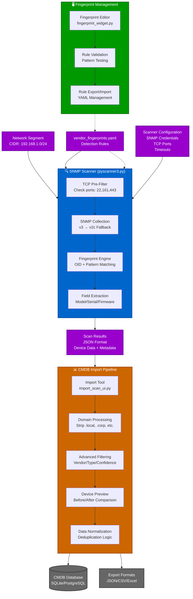
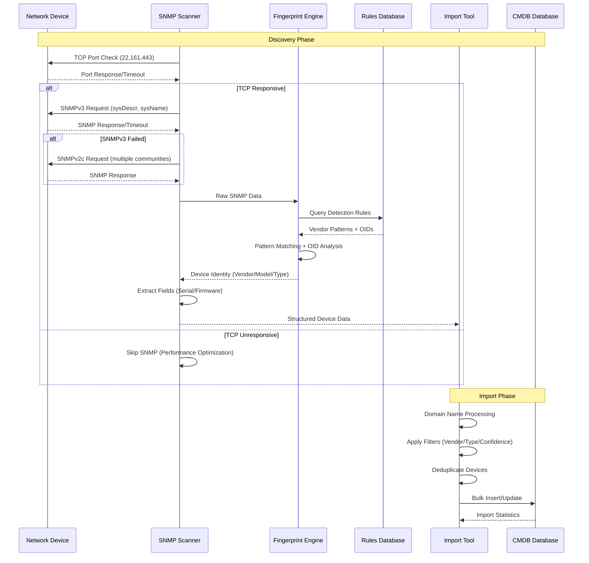
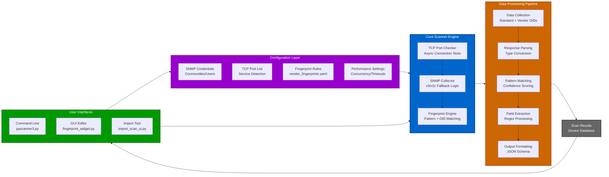

# SNMP Network Scanner Suite

A comprehensive, open-source network discovery solution with advanced device fingerprinting, intelligent domain handling, and seamless CMDB integration.


*Complete scanning workflow from discovery to CMDB import*

## Overview

This scanner suite provides enterprise-grade network device discovery through SNMP with a focus on accuracy, customization, and practical deployment needs. Built for network administrators who need reliable device identification without vendor lock-in.

## Architecture



## Data Flow Architecture



## Component Architecture



## Core Components

### 🔍 **SNMP Scanner (`pyscanner3.py`)**
High-performance async SNMP scanner with intelligent fallback strategies and robust error handling.


*Real-time scan progress with device detection and vendor identification*

### 📋 **Fingerprint Engine (`vendor_fingerprints.yaml`)**
Completely open and customizable device identification rules - no black box algorithms.

```yaml
cisco:
  definitive_patterns:
    - pattern: "cisco ios software"
      confidence: 100
  fingerprint_oids:
    - name: "Cisco Catalyst Model"
      oid: "1.3.6.1.4.1.9.1.2694"
      definitive: true
```

### 🖥️ **Fingerprint Editor (`fingerprint_widget.py`)**
GUI editor for managing vendor detection rules with data preservation guarantees.


*Main fingerprint editor interface with vendor list and configuration tabs*


*Configure definitive patterns, detection rules, and exclusion filters*


*Vendor-specific SNMP OID configuration with priority and definitiveness settings*


*Device type classification rules and extraction patterns*


*Raw YAML editor with syntax highlighting and validation*

### 📊 **CMDB Import Tool (`import_scan_ui.py`)**
Advanced import processor with domain normalization and enterprise-ready filtering.


*Main CMDB import interface showing scan file management and device preview*


*Domain name stripping configuration with custom patterns and before/after preview*


*Device preview table showing original names, stripped names, and domain processing results*


*Comprehensive statistics and vendor breakdown after import processing*

## Key Features

### **Smart SNMP Strategy**
- **Version fallback**: Automatically tries SNMPv3 → SNMPv2c with multiple communities
- **TCP pre-filtering**: Skip SNMP attempts on unresponsive hosts (major performance boost)
- **Concurrent scanning**: Configurable parallelism with intelligent rate limiting
- **Error resilience**: Auto-creates output directories, handles network timeouts gracefully


*SNMP version fallback and TCP pre-filtering workflow*

### **Advanced Device Fingerprinting**
- **Definitive OID matching**: 100% confidence identification using vendor-specific MIBs
- **Pattern hierarchy**: Definitive → detection → exclusion pattern matching
- **Field extraction**: Smart regex-based model/serial/firmware extraction
- **Device type classification**: Granular categorization (switch/router/AP/UPS/firewall/etc.)


*Device fingerprinting workflow from SNMP data to vendor identification*

### **Domain Intelligence**
- **Automatic domain stripping**: Removes `.local`, `.corp`, `.com` suffixes for clean hostnames
- **Custom domain patterns**: Add organization-specific domains to strip
- **Before/after preview**: Visual confirmation of domain processing
- **Deduplication friendly**: Normalized names prevent duplicate entries


*Before and after domain stripping with highlighted changes*

### **Enterprise Integration**
- **CMDB-ready output**: Direct import into asset management systems
- **Batch processing**: Handle multiple scan files with filtering and validation
- **Export flexibility**: JSON, CSV formats with customizable field selection
- **Audit trails**: Comprehensive logging of all operations


*End-to-end workflow from network scan to CMDB integration*

## What Makes This Unique

### **Truly Open Fingerprinting**
Unlike commercial solutions, every detection rule is visible and editable. No vendor databases to license, no proprietary algorithms to reverse-engineer. Add support for custom devices in minutes, not months.


*Comparison of open fingerprinting vs. proprietary black-box solutions*

### **Domain Name Intelligence**
Handles the real-world mess of inconsistent domain naming. Enterprise networks often have devices with mixed domain suffixes (`.local`, `.domain.com`, bare hostnames) - this scanner normalizes them intelligently.

### **Performance Without Compromise**
TCP pre-filtering dramatically reduces scan time by skipping SNMP attempts on hosts that aren't listening. Combined with async processing and smart timeouts, you get both speed and accuracy.


*Scan time comparison with and without TCP pre-filtering*

### **Data Preservation Architecture**
The fingerprint editor preserves all existing YAML data when making changes. Edit vendor rules without fear of losing custom configurations or breaking existing detection logic.


*YAML editor showing preserved fields alongside UI-managed configuration*

### **Real-World Error Handling**
Built by network admins for network admins. Handles the edge cases: missing directories, permission issues, network timeouts, malformed responses, inconsistent device configurations.

## Quick Start

### Basic Network Scan
```bash
python3 pyscanner3.py --cidr 192.168.1.0/24 --output results.json
```


*Terminal output showing scan progress and device discovery*

### Advanced Scan with Filtering
```bash
python3 pyscanner3.py \
    --cidr 10.0.0.0/16 \
    --concurrent 50 \
    --snmp-version v2c \
    --communities public,private,community \
    --tcp-ports 22,161,443 \
    --output ./results/scan_$(date +%Y%m%d).json
```


*Detailed scan results with vendor breakdown and statistics*

### Custom Fingerprint Development
1. Run initial scan to identify unknown devices
2. Launch fingerprint editor: `python3 fingerprint_widget.py`
3. Add vendor rules using captured SNMP data
4. Validate and test new fingerprints
5. Re-scan to verify improved detection


*Step-by-step process for developing custom device fingerprints*

### CMDB Import with Domain Processing
1. Launch import tool: `python3 import_scan_ui.py`
2. Add scan files and configure domain stripping
3. Preview processed device names
4. Import to database with confidence filtering


*Complete CMDB import process with domain processing and validation*

## Requirements

- Python 3.8+
- `pysnmp` for SNMP operations
- `PyQt6` for GUI components (fingerprint editor, import tool)
- `pyyaml` for configuration management

```bash
pip install pysnmp pyyaml PyQt6
```

## Configuration

### SNMP Credentials
- **SNMPv3**: Username, auth protocol/key, privacy protocol/key
- **SNMPv2c**: Multiple community strings with automatic fallback
- **Mixed environments**: Automatic version detection and fallback


*SNMP credential configuration options and version fallback settings*

### Fingerprint Rules
- **Vendor patterns**: Text matching in system descriptions
- **OID fingerprints**: Vendor-specific MIB object queries
- **Device classification**: Rule-based type determination
- **Field extraction**: Regex patterns for model/serial/firmware


*Overview of fingerprint rule configuration options*

### Performance Tuning
- **Concurrency**: Balance between speed and network load
- **Timeouts**: Adjust for network latency and device response times
- **TCP pre-filtering**: Skip SNMP on unresponsive hosts


*Performance configuration options and recommended settings*

## Contributing

The fingerprint database is community-driven. Submit vendor detection rules, device type classifications, and field extraction patterns via pull requests. All contributions are immediately visible and auditable.


*Process for contributing new vendor fingerprints and device rules*

## License

Open source - adapt, modify, and deploy without licensing restrictions.

---

*Built for network professionals who need reliable device discovery without vendor lock-in or proprietary limitations.*


*Complete ecosystem showing all components working together*