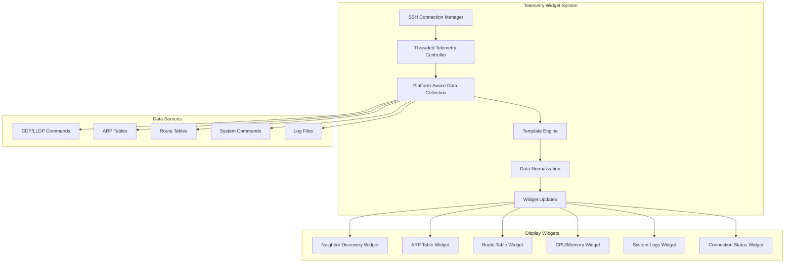

# Terminal Telemetry - Real-Time Network Device Monitoring

> **Advanced real-time telemetry and monitoring system for network devices with embedded SSH terminal integration**


---

## 🎯 Overview

The **Terminal Telemetry System** is a sophisticated real-time monitoring platform that provides live insights into network device performance, neighbor relationships, routing tables, and system health. It seamlessly integrates with SSH sessions to deliver telemetry data directly within your terminal workflow.

### Key Features

- **🔄 Real-Time Data Collection** - Live CPU, memory, and interface monitoring
- **🌐 Network Discovery** - CDP/LLDP neighbor discovery and visualization  
- **📊 Multi-Protocol Support** - Works with Cisco IOS/XE/NX-OS, Arista EOS, Juniper, Linux, and more
- **🎨 Advanced Theming** - 20+ retro-inspired themes with cyberpunk aesthetics
- **📈 Interactive Widgets** - Resizable, exportable data tables and visualizations
- **🔧 Template Engine** - Customizable data parsing templates for any platform
- **📁 CSV Export** - Export all telemetry data to CSV for analysis
- **⚡ Zero-Latency Updates** - Sub-second refresh rates with threaded data collection

---

## 🏗️ Architecture



---

## 🖥️ Interface Components

### **Connection Management**
- **Smart Connection Dialog** - Device credentials with session file integration
- **Platform Auto-Detection** - Automatic platform identification and optimization
- **Session Persistence** - Resume connections and maintain state
- **Browse Session Files** - Load connection details from multiple session files

### **Real-Time Monitoring Widgets**

#### **1. CDP/LLDP Neighbors Widget**
```
┌─ CDP/LLDP NEIGHBORS ─────────────────── ⚙️ Export CSV ┐
│ Local Interface │ Neighbor Device    │ Remote Interface │
├─────────────────┼───────────────────┼──────────────────┤
│ Gi0/1           │ SWITCH-01.lab.com │ Gi0/24           │
│ Gi0/2           │ RTR-01.lab.com    │ Gi0/1            │
└─────────────────────────────────────────────────────────┘
Platform: cisco_ios_xe | Neighbors: 15
```

**Features:**
- Real-time neighbor discovery via CDP and LLDP
- Platform and capability detection
- IP address resolution
- Color-coded protocol indicators
- CSV export functionality
- Template editor for custom parsing

#### **2. ARP Table Widget**
```
┌─ ARP TABLE ──────────────────────────── ⚙️ Export CSV ┐
│ IP Address    │ MAC Address       │ Interface │ State │
├───────────────┼───────────────────┼───────────┼───────┤
│ 10.68.48.16   │ 0000.0c9f.fbb8   │ Vlan3000  │ Active│
│ 10.68.48.17   │ ecb9.0700.6af3   │ Vlan3000  │ Active│
└───────────────────────────────────────────────────────┘
Platform: cisco_ios_xe | Entries: 127
```

**Features:**
- Live ARP table monitoring
- MAC address tracking
- Interface association
- Entry age and state tracking
- Cross-platform normalization
- Export capabilities

#### **3. Route Table Widget**
```
┌─ ROUTE TABLE ────────────────────────── ⚙️ Export CSV ┐
│ VRF: [default ▼] │ Filter: [All Protocols ▼]         │
├──────────────────┴─────────────────────────────────────┤
│ Network        │ Next Hop      │ Protocol │ Interface │
├────────────────┼───────────────┼──────────┼───────────┤
│ 0.0.0.0/0     │ 10.68.48.18   │ Static   │ Vlan1000  │
│ 10.68.48.0/26 │ Connected     │ Connected│ Vlan1000  │
└─────────────────────────────────────────────────────────┘
Platform: cisco_ios_xe | Routes: 63 | VRF: default
```

**Features:**
- Multi-VRF route table support
- Protocol-based filtering (Static, OSPF, BGP, EIGRP, etc.)
- Administrative distance and metric display
- Color-coded protocol indicators
- Real-time routing updates
- Advanced export options

#### **4. CPU/Memory System Widget**
```
┌─ SYSTEM INFORMATION ──────────────────────────── ⚙️ ┐
│ Device Information                                 │
│ ├─ Hostname: cal-ot-core-01                      │
│ ├─ Hardware: C9200L-48P-4X                       │
│ ├─ Version: 17.9.6a                              │
│ └─ Uptime: 12 weeks, 6 days, 45 minutes          │
│                                                    │
│ Resource Utilization                               │
│ ├─ CPU Usage:    [████████░░] 2%                  │
│ ├─ Memory Usage: [███████░░░] 18%                 │
│ └─ Total: 1,791 MB | Free: 1,456 MB              │
└────────────────────────────────────────────────────┘
Platform: cisco_ios_xe | Last Update: 16:24:50
```

**Features:**
- Real-time CPU utilization monitoring
- Memory usage tracking with breakdown
- System uptime and version information
- Color-coded utilization indicators
- Temperature monitoring (when available)
- Platform-agnostic data normalization

#### **5. System Logs Widget**
```
┌─ SYSTEM LOGS ────────────── Auto Clear Export ┐
│ === Log Output Retrieved at 16:24:50 ===       │
│                                                 │
│ Jul 21 15:13:48.051 PDT: %SYS-6-LOGOUT: User   │
│ Jul 21 15:13:48.705 PDT: %SEC_LOGIN-5-LOGIN... │
│ Jul 21 15:14:00.057 PDT: %SYS-5-CONFIG_I: C... │
│ Jul 21 15:14:00.622 PDT: %SEC_LOGIN-5-LOGIN... │
│                                                 │
└─────────────────────────────────────────────────┘
Platform: cisco_ios_xe | Last Update: 16:24:50
```

**Features:**
- Real-time system log monitoring
- Automatic log refresh capabilities
- Export functionality for log analysis
- Clean, readable monospace formatting
- Configurable auto-scroll behavior

---

## 🚀 Getting Started

### **Prerequisites**
```bash
# Python 3.8+ with PyQt6
pip install PyQt6 paramiko netmiko cryptography
```

### **Basic Usage**

#### **1. Launch Telemetry Interface**
```python
from termtel.termtelwidgets.telemetry_widget import TelemetryWidget
from termtel.themes3 import ThemeLibrary

# Create theme system
theme_library = ThemeLibrary()

# Create telemetry widget
telemetry = TelemetryWidget(
    shared_services={'theme_manager': theme_library},
    parent=main_window
)

# Add to your application
main_layout.addWidget(telemetry)
```

#### **2. Connect to Device**
```python
# Programmatic connection
telemetry.connect_to_device_programmatic(
    hostname="switch-01.lab.com",
    ip_address="192.168.1.100", 
    platform="cisco_ios_xe",
    credentials=credentials_object
)

# Or use the connection dialog
telemetry._show_connection_dialog()
```

#### **3. Handle Telemetry Events**
```python
# Connect to telemetry signals
telemetry.device_connected.connect(on_device_connected)
telemetry.telemetry_data_updated.connect(on_telemetry_update)
telemetry.device_error.connect(on_device_error)

def on_telemetry_update(device_id, telemetry_snapshot):
    print(f"Received telemetry from {device_id}")
    print(f"CPU: {telemetry_snapshot.get('cpu_percent', 'N/A')}%")
    print(f"Routes: {len(telemetry_snapshot.get('routes', []))}")
```

---

## 🎨 Theme System

The telemetry system supports 20+ advanced themes with retro-inspired aesthetics:

### **Featured Themes**
- **🌊 Cyberpunk 2077** - Neon cyan terminals with dark backgrounds
- **👹 Doom** - Classic red-on-black gaming aesthetic  
- **🖥️ CRT Green** - Classic green phosphor terminal look
- **🔥 CRT Amber** - Warm amber monochrome display
- **💼 Borland IDE** - Classic blue development environment
- **🌲 Forest** - Nature-inspired green color scheme

### **Theme Integration**
```python
# Apply theme to telemetry widget
telemetry.set_theme_from_parent("cyberpunk")

# Themes automatically sync across all widgets
# - Progress bars adapt colors
# - Tables update styling  
# - Text colors adjust for readability
# - Protocol indicators use theme colors
```

---

## 🔧 Advanced Configuration

### **Template Engine**
The telemetry system uses a powerful template engine for parsing device output:

```yaml
# Example neighbor template for Cisco IOS
cisco_ios_xe:
  neighbor_widget:
    commands:
      - "show cdp neighbors detail"
      - "show lldp neighbors detail"
    
    parsing:
      neighbor_blocks:
        delimiter: "-------------------------"
        fields:
          device_id: "Device ID: (.+)"
          local_interface: "Interface: (.+?),"
          remote_interface: "Port ID \\(outgoing port\\): (.+)"
          ip_address: "IP address: (.+)"
          platform: "Platform: (.+?),"
          capabilities: "Capabilities: (.+)"
```

### **Platform Support**
Built-in support for major network platforms:

| Platform | CDP/LLDP | ARP | Routes | CPU/Memory | Logs |
|----------|----------|-----|--------|------------|------|
| **Cisco IOS/XE** | ✅ | ✅ | ✅ | ✅ | ✅ |
| **Cisco NX-OS** | ✅ | ✅ | ✅ | ✅ | ✅ |
| **Arista EOS** | ✅ | ✅ | ✅ | ✅ | ✅ |
| **Juniper JunOS** | ✅ | ✅ | ✅ | ✅ | ✅ |
| **Linux** | ✅ | ✅ | ✅ | ✅ | ✅ |
| **HP ProCurve** | ✅ | ✅ | ✅ | ⚠️ | ⚠️ |
| **Aruba AOS** | ✅ | ✅ | ✅ | ⚠️ | ⚠️ |

**Legend:** ✅ Full Support | ⚠️ Partial Support

### **CSV Export Format**
All widgets support CSV export with rich metadata:

```csv
# CDP/LLDP Neighbors Export
# Generated: 2025-01-21 16:24:50
# Platform: cisco_ios_xe | Command: show cdp neighbors detail
# Data Source: Normalized
# Total Neighbors: 15

Local Interface,Neighbor Device,Remote Interface,IP Address,Platform,Protocol,Capabilities
TenGigabitEthernet6/0/1,cal-hr02-sw1-01.columbia.csc,TenGigabitEthernet1/1/1,10.68.57.102,cisco C9200L-48P-4X,CDP,Switch IGMP
TenGigabitEthernet5/0/3,cal-hr05-sw1-01.columbia.csc,TenGigabitEthernet1/1/1,10.68.57.105,cisco C9200L-48P-4X,CDP,Switch IGMP
```

---

## 📊 Performance & Scalability

### **Data Collection Performance**
- **Refresh Rate:** Sub-second updates with threaded collection
- **Memory Usage:** ~50MB for typical telemetry session
- **CPU Impact:** <2% CPU usage during active monitoring
- **Concurrent Devices:** Support for multiple simultaneous connections

### **Widget Responsiveness**
- **Table Updates:** <100ms for data refresh
- **Theme Changes:** <50ms for complete re-styling
- **CSV Export:** <500ms for 1000+ row tables
- **Connection Time:** <3 seconds for typical SSH connection

### **Scalability Metrics**
| Metric | Performance |
|--------|-------------|
| **Neighbors Displayed** | 500+ entries |
| **ARP Entries** | 1000+ entries |
| **Route Table Size** | 5000+ routes |
| **Log Buffer** | 10,000 lines |
| **Refresh Interval** | 1-300 seconds |

---

## 🔌 Integration & Embedding

### **Embedding in Applications**
The telemetry system is designed as a reusable QWidget:

```python
from termtel.termtelwidgets.telemetry_widget import TelemetryWidget

class NetworkManagementApp(QMainWindow):
    def __init__(self):
        super().__init__()
        
        # Create central layout
        central_widget = QWidget()
        layout = QHBoxLayout(central_widget)
        
        # Add telemetry widget
        self.telemetry = TelemetryWidget(parent=self)
        layout.addWidget(self.telemetry)
        
        # Connect to telemetry events
        self.telemetry.device_connected.connect(self.on_device_connected)
        self.telemetry.telemetry_data_updated.connect(self.on_data_update)
```

### **Signal Integration**
Rich signal system for parent application integration:

```python
# Device connection events
device_connected(hostname: str, ip: str, device_info: object)
device_disconnected(hostname: str, ip: str) 
device_error(hostname: str, ip: str, error_msg: str)

# Data update events  
telemetry_data_updated(device_id: str, snapshot: dict)
widget_status_changed(status_message: str)

# Theme events (when used standalone)
theme_changed(theme_name: str)
```

---

## 🛠️ Customization

### **Widget Layout Customization**
```python
# Hide control panels for embedded use
telemetry.left_panel.setVisible(False)

# Adjust widget sizes
telemetry.neighbor_widget.setMaximumHeight(300)
telemetry.route_widget.setMinimumWidth(600)

# Customize refresh intervals
telemetry.controller.set_auto_refresh_interval(30)  # 30 seconds
```

### **Custom Data Handlers**
```python
# Add custom data processing
def custom_neighbor_processor(neighbor_data):
    # Add custom fields or filtering
    for neighbor in neighbor_data:
        neighbor.custom_field = calculate_custom_metric(neighbor)
    return neighbor_data

telemetry.controller.add_data_processor('neighbors', custom_neighbor_processor)
```

### **Theme Customization**
```python
# Create custom theme
custom_theme = {
    'name': 'custom_corporate',
    'background': '#1e1e1e',
    'text': '#ffffff', 
    'primary': '#007acc',
    'success': '#4ec9b0',
    'error': '#f44747'
}

telemetry.theme_library.add_theme('custom_corporate', custom_theme)
telemetry.set_theme_from_parent('custom_corporate')
```

---

## 🔍 Troubleshooting

### **Common Issues**

#### **Connection Problems**
```bash
# Check SSH connectivity
ssh username@device-ip

# Verify platform detection
telemetry.controller.platform_config.get_platform('cisco_ios_xe')

# Enable verbose logging
telemetry.controller.set_debug_mode(True)
```

#### **Data Collection Issues**
```python
# Check template availability
templates = telemetry.controller.get_available_templates('cisco_ios_xe')

# Verify command execution
raw_output = telemetry.controller.execute_command('show version')

# Test data normalization
normalized = telemetry.controller.normalize_data(raw_output)
```

#### **Performance Issues**
```python
# Adjust refresh intervals
telemetry.controller.set_auto_refresh_interval(60)  # Slower refresh

# Disable auto-refresh for specific widgets
telemetry.route_widget.auto_refresh = False

# Monitor memory usage
import psutil
process = psutil.Process()
print(f"Memory usage: {process.memory_info().rss / 1024 / 1024:.1f} MB")
```

### **Debug Mode**
```python
# Enable comprehensive debugging
telemetry.controller.set_debug_mode(True)

# Check controller status
status = telemetry.get_connection_status()
device_info = telemetry.get_device_info()

# Monitor signal emissions
telemetry.device_connected.connect(lambda *args: print(f"Connected: {args}"))
telemetry.telemetry_data_updated.connect(lambda *args: print(f"Data: {args}"))
```

---

## 📈 Future Enhancements

### **Planned Features**
- **📱 Mobile-Responsive Interface** - Touch-optimized telemetry widgets
- **🔔 Alert System** - Threshold-based monitoring and notifications
- **📈 Historical Data** - Time-series data collection and graphing
- **🔗 Multi-Device Correlation** - Cross-device topology and dependency mapping
- **🤖 AI-Powered Insights** - Anomaly detection and predictive analytics
- **☁️ Cloud Integration** - Export to cloud monitoring platforms

### **API Enhancements**
- **REST API** - Programmatic access to telemetry data
- **WebSocket Streaming** - Real-time data streaming for web clients
- **GraphQL Support** - Flexible data querying capabilities
- **Plugin Architecture** - Third-party widget development

---

## 📚 Related Documentation

- **[Main Application README](README_Overview.md)** - Complete platform overview
- **[Connection Management](connection_dialog.py)** - Device connection system
- **[Theme System](themes3.py)** - Advanced theming documentation
- **[Platform Templates](platform_templates/)** - Custom template creation
- **[Widget Development](widget_development.md)** - Creating custom telemetry widgets

---

## 🤝 Contributing

The telemetry system welcomes contributions:

### **Development Areas**
- **Platform Support** - Add new network device platforms
- **Widget Features** - Enhance existing telemetry widgets
- **Template Engine** - Improve data parsing capabilities
- **Performance** - Optimize data collection and display
- **Documentation** - Improve guides and examples

### **Getting Started**
```bash
# Clone the repository
git clone https://github.com/scottpeterman/terminaltelemetry.git

# Install development dependencies
pip install -r requirements-dev.txt

# Run telemetry in development mode
python -m termtel.termtelwidgets.telemetry_widget
```

---

*"Real-time network intelligence at your fingertips"*

**Terminal Telemetry** - *Where advanced monitoring meets retro aesthetics*